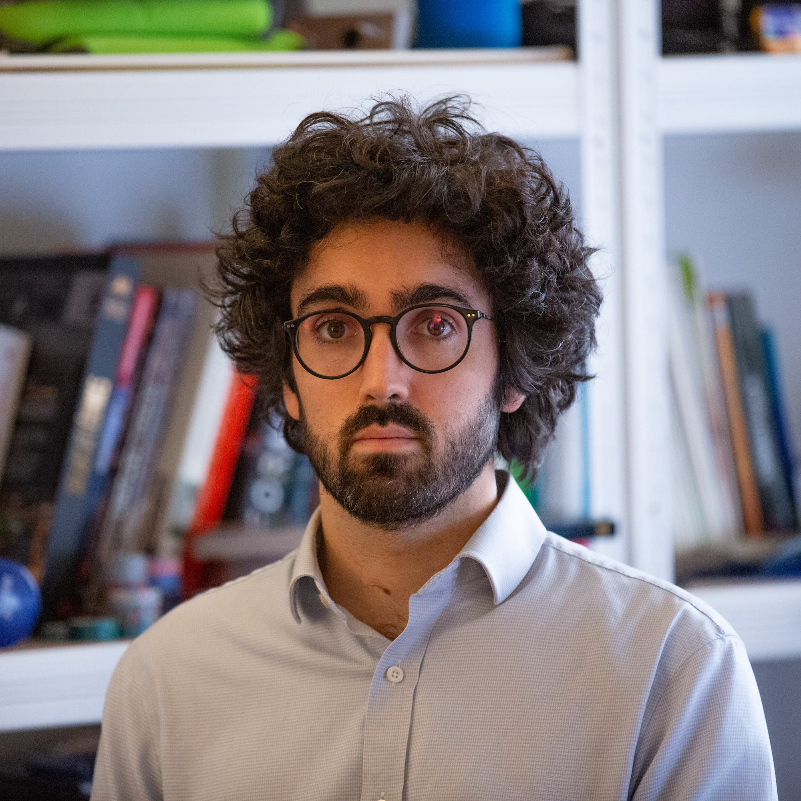

# Who's there!

Hey, my name is Pierre Chevallier and I'm working in IT for over 10 years, having focused my career on databases, data science and data processing.

{ width="300" }

I have experience in financial markets, air traffic control and workforce analytics, with a focus on founding teams and upscalling them to be effective with technologies.

During my free time I like [to run](https://www.strava.com/athletes/69848982), to climb and also to do [judo](judo/index.md).
