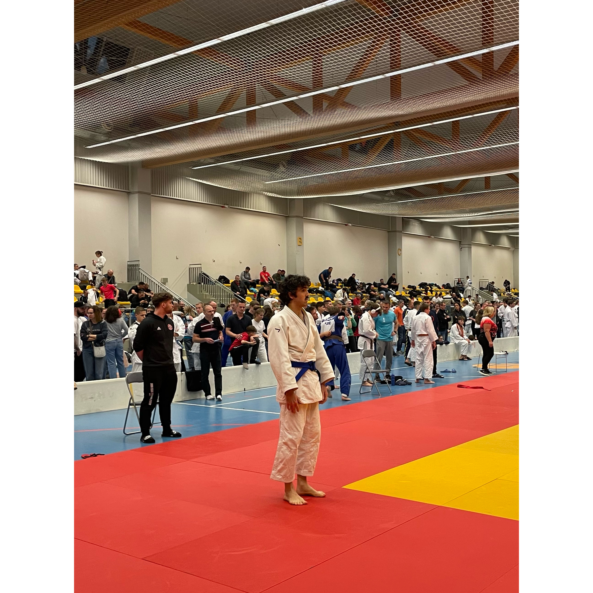

## What's new?

Alrighty, let's go for 2026, honestly I have had quite some fun working again on this site, and I'm looking forward to 2026.

{ maxwidth="400" }

This is me above before my second match (and last) of my competition in December 2025. I need to compete more and encourage those interested to try it as well. It's loads of fun.

Right now I took some time to think about building [a page and a space for judo, mostly focused on the Czech Republic side of it](../../judo/index.md). Let's see how it goes. The objective is to consolidate what there was on Notion and what we worked on with Kuba for my blue belt's exam in November 2025.

## Technology?

### The blog

The website took some time to update, but I think I start to be satisfied with how it looks. It's based on [Material for Mkdocs](https://squidfunk.github.io/mkdocs-material/), so a tad simpler to use than the previous one I had a couple of years back with Netlify and Gatsby. The biggest improvement is also the GitHub Actions that are very fast to deploy.

Another thing to do to improve the website, beyond content, is to integrate some form of comment system. I'm going to likely try Giscus. But I need some time to set it up.

### Other stuff

I haven't been idle on the other fronts but haven't posted for quite some time... So right now I've learnt a few things in [Airflow](https://airflow.apache.org/), like dags and so on; as well as, connecting to LLMs through APIs, which is useful.

2 years ago already I did an internal bootcamp on LLMs where I scored th highest for it in terms of points. Eh, happy about it, but I'm certainly no expert.

I have some ideas to write, perhaps about distributed computing and setting up teams, but quite honestly right now I'll focus on stuff I like. For the moment: judo!
