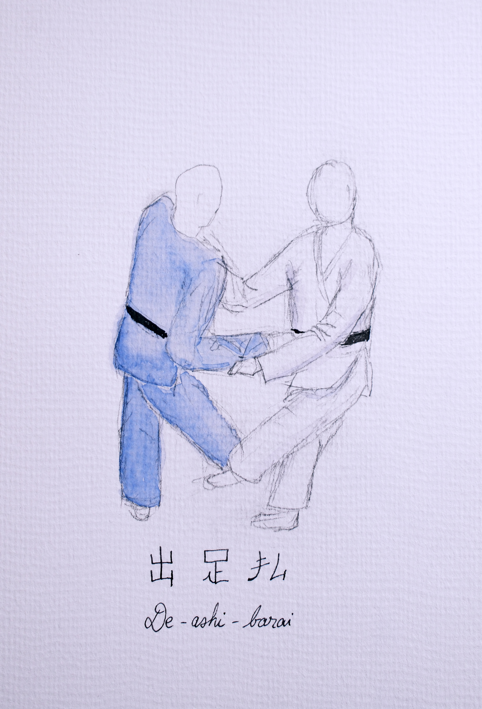

The gokyo is essentially the 40 techniques originally written by [Jigoro Kano](https://en.wikipedia.org/wiki/Kan%C5%8D_Jigor%C5%8D) for his standard syllabus. These techniques are organised into 5 different sets and there are additional sets for newer techniques which were added in 1982.

## Personal note

My personal endeavour is to paint each of the 40 techniques during the year 2026 and add details for each of them. This is in parallel of my regular trainings and more of a fun task to get back into watercolour painting.

## 1st group

Also called dai-ikkyo.

### De-ashi-harai or de-ashi-barai

Meaning foot sweep of the forward or leading leg. It's supposed to be performed while uke still has his foot in the air and is about to land it.

{width="500" }

The timing is quite frankly the most important aspect of this throw, but it's a very rewarding one. It's also the one that got me thrown the most in randori last year due to my stance being too forward.

### Hiza-guruma

Meaning knee-wheel.

Quite similar to its sister technique, sasae-tsurikomi-ashi, it is a block of the leg at the knee. It has a push-pull aspect at the shoulder to get your opponent off-balance and towards you, so you can block the leg.

{width="500" }

I prefer to hit it off the lapel side rather than the sleeve (which is the kodokan way). It's an effective technique to combine left/right for renzoku waza.