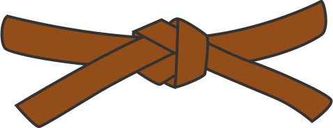
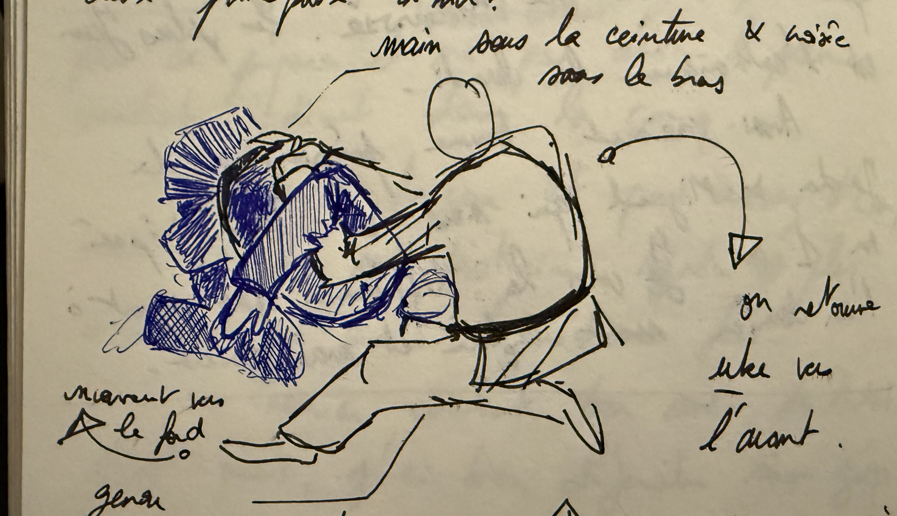
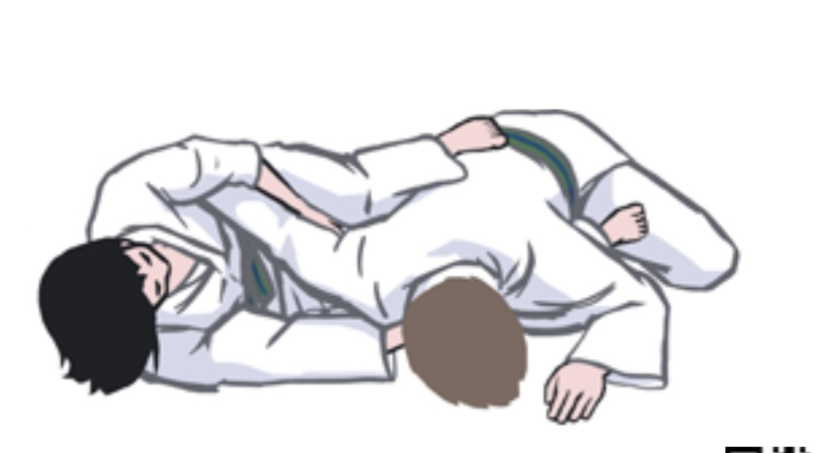

Let's focus on the judo grades in the Czech Republic (up to the 1st Kyu or brown belt).

!!! Info "Where to find the curriculum"

    You can download the current curriculum for the judo grades [from the Czech Judo Association at this link](https://www.czechjudo.org/dokument/288-zkusebni-rad-metodicka-priloha-obrazky-do-1-kyu).

## Structure

The grades are in descending order, that is the lower the kyu, the more experienced is the practitioner (up to Dan grades, from 1st Dan you are a black belt).

Grades quite honestly don't mean that you are "better" and can beat anybody from a lower grade, it's merely an indication of your experience with the sport, your knowledge of the techniques and also how safe you are to be thrown (an experienced judoka might throw you around more if you are experienced and be a bit more gentle if you are a white belt... obviously).

!!! info "Where do you get graded"

    The kyu grades are performed with your [sensei]("coach or teacher") or the coach of your club. They are then registered with the Czech Judo Association and the national body. But they are done at your dojo or during training camps.

    Shodan and subsequent Dan grades are done with the Czech Judo Association and governing body.

### How does the grading go?

You will enter the mat from the right side of the commisioner (usually your sensei or joseki), bow on the edge of the mat (towards your [uke]("sparring partner")), then step forward to bow again to the commisioner and start the grading.

!!! info "What to do if I perform a throw badly!"

    Usually it's best to just repeat the throw if you feel like it, depending on your level of stress but also on the requirements for the grade.

    Most of the time, if it's a slight mistake (like on throws opposite of your dominant arm), the sensei will let it slide.

About the grading on [ne-waza]("ground techniques"), it is important to be able to actually show the technique to the sensei. Don't show them your bottom and instead show them the side that matters for this particular technique.

At the end of the exam, you can expect the sensei to ask you a few questions about terms in Japanese.

## Kyu grades and belt colours

### White belt { width="40px" }

_Called technically 6th Kyu, or rokkyu._

Everyone is a white belt, or at least everyone that stepped on the mat at least once. Not much is expected here, the journey just begins.

### Yellow belt { width="40px" }

_Called 5th Kyu, or gokyu._

Up to yellow belt, it's expected of you to know your [ukemi]("breakfalls") and a bit of techniques and the basic words of judo in Japanese.

You'll need also to show that you can do the techniques of the curriculum and the [ne-waza]("ground techniques") "wheel" aka the different ground techniques in succession without lifting your chest from [uke]("sparring partner")'s.

### Orange belt { width="40px" }

_Called 4th Kyu, or yonkyu._

At orange belt, it's expected to have a better grasp of the techniques, understanding how to combine them and also better control on their execution.

Another expectation is to start being creative, in that you need to craft 2 [combinations of techniques]("renraku waza"), 2 [same techniques]("renzoku-waza") in succession and 2 [counters]("gaeshi-waza"). You can refer to [the combinations page](combinations.md) for inspiration.

The [hairi-kata]("literrally entry forms") also starts to show up. It's a mean to show that you know how to continue the fight on the ground, transitioning from standing to ground techniques. The hairi-kata here is "guided", in that you already know what you showcase to the sensei:

- uke on the belly
- uke on the back, [tori]("you, or the one that executes the technique") is in between their legs
- tori is turtle and uke attacks from above (from the rules, but I need to check if this is the actual performance expected)
- tori is on the back and uke is between their legs (how to defend from guard)

### Green belt { width="40px" }

_Called 3rd Kyu, or sankyu._

At green belt, the expectations are higher, you need to show more control on your techniques, be able to adapt them to different situations and also show more creativity.

Now you need to obviously perform the techniques from the curriculum but you also have more combos to prepare with 3 of each.

The hairi-kata now is not bounded by specific expectations from the curriculum, you merely have to showcase 2 transitions to [osae-komi-waza]("holding techniques") and to [shime-waza]("choke-holds"). Obviously they need to make sense (applicable to your division and randori), they should rather mix different positions for uke and tori (pancake, turtle, open and closed guard etc.).

!!! tip "Tokui-waza"

    At this level, it's a good idea to start looking/demonstrating on your [tokui-waza]("favourite techniques"). You should be able to execute it in [randori]("free practice, sparring") and [shiai]("competition").

### Blue belt { width="40px" }

_Called 2nd Kyu, or nikyu._

The kata starts now, you also are expected to be able to guide newcomers or help on techniques.

Actually in the Czech Republic, this grade has a lot of intricacies and expectations. Most notably you will have to do 9 tachi-waza, 9 ne-waza and also the first 2 series of the [nage-no-kata]("form of throws").

The combinations are now of 4 of each and the hairi-kata now contains 2 [kansetsu-waza]("arm/joint-locks"). They should reflect variety in the application as well as a competition style approach (they are practical).

!!! tip Your uke and training partner

    It's good if you start to know at that point who your uke is going to be most of the time and espcially for practicing the exams. This leads to good consistency in the results

### Brown belt { width="40px" }

_Called 1st Kyu, or ikkyu._

Last stage before black belt. There are a bit less techniques but you have the 3 last series of the nage-no-kata.

The most important part, is that this is the last point where you can get graded in your dojo. At that point the sensei expects you to be able to do the throws cleanly and with a lot of control. This is to make sure you are ready to prepare your shodan (or first degree black belt).

## Hairi-kata: forms of entry

So this excerpt is straight from my notes for the blue belt. I'll update later for more details:

_Hairi-kata: Variants to control in newaza. Preferably mixing between tori and uke: positions in turtle, prone, guards._

_Reference for more, [video with 6 variations around closed guard (in French)](https://youtu.be/_EOE2oLSU7w?si=s_WiMABHmvudgs0d)_

Reference from Instagram

1. [Insta example 1, David Klammert](https://www.instagram.com/reel/DRcDyoujwbl/?igsh=NmoxcXo4cnByZTdr)
2. [Insta example 2, David Klammert](https://www.instagram.com/reel/DQ636_iCOJs/?igsh=MTJmcndleTN2ODM0cA==)
3. [Insta example 3, David Klammert](https://www.instagram.com/reel/DQby_5kCNx5/?igsh=dXV1ZTJrYTZhcDV4)

Other reference from blue belt

### Variants to osaekomi-waza

Osaekomi-waza: control of the body

- (Uke open guard to) to whichever regular hold (e.g. **kesa**, **tate-shiho etc. gatame) ([video](https://youtube.com/shorts/aK6A7DiKo_g?si=iY4mH09LtfpIP3eE))**
- (Uke turtle to) regular hold (e.g. **kami-shiho-gatame) or ([turn video on instagram](https://www.instagram.com/p/DQWvFtPCPoR/?img_index=1&igsh=MWg4MWprMms5ZGlxMQ==))**
  - 

### Variants to shime-waza

Shime-waza: choke-holds

- (Uke in turtle to) **koshi-jime** (grab offside lapel and overlap with leg) [video on youtube](https://youtube.com/shorts/BTvNQFtgQvU?si=l9iugOX1yfc3UAyv)
- (Uke in prone/belly down) lift to **sode-guruma-jime** or **hadaka-jime (**[video, first turnover](https://youtu.be/b9VjpLB54c0?si=pEjxaw6XI3PC2OGL)**)** or ****closed guard **tori to sode-guruma-jime (better)**

### Variants to kansetsu-waza

Kansetsu-waza: armbars

- (Tori in open-guard) shrimp escape to **ude-hishigi-hiza-gatame**
  - { width="200px" }
- Uke in turtle, tori grabs the belt and the top of the collar and pops the arm open to go for **ude-hishigi-ashi-gatame**
  - { width="200px" }
