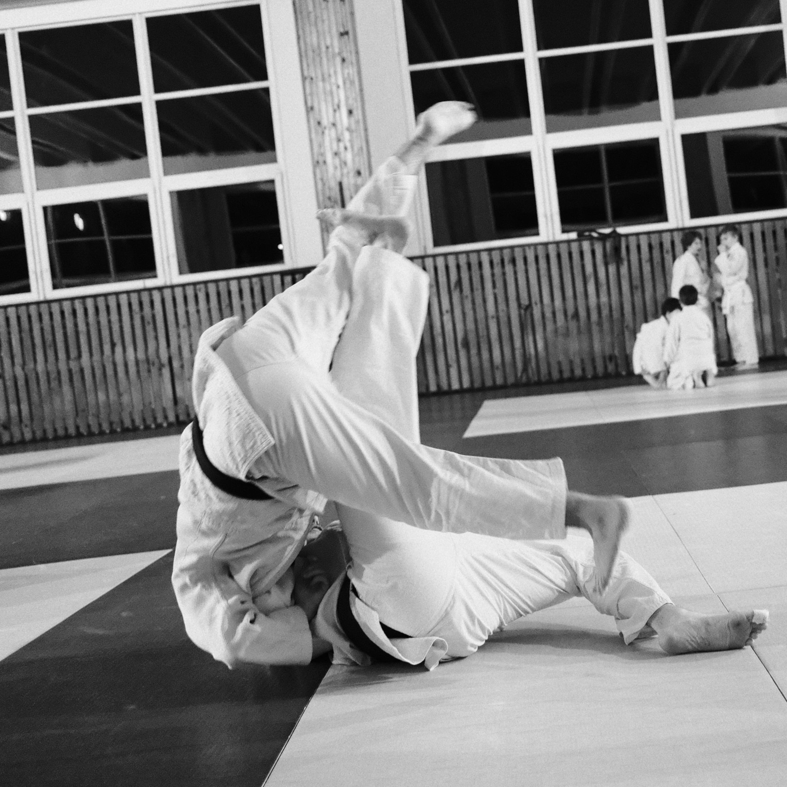

## What is this page

This page contains some items around judo in the Czech Republic, as well as some ideas I had or notes I took and I found worthwhile sharing.

Judo content is everywhere on the internet. Judo content in the Czech Republic and in English... Not so much. While the curriculum is clear up to the 1st Kyu (brown belt), the understanding can be spotty if you are not training at a club where numerous people speak English or are translating for you. I'd like to bridge a gap I see in that. It could also help judokas outside of here or even Czech judokas.

{ align=left, maxwidth="500" }

At the end of the day, it's for me a mean to keep track of what I learnt as well as perhaps inspire some to bring their ideas to judo.

## Who am I?

I have started judo in 2019, just as COVID was about to hit, honestly I have started to seriously train since 2022, so as I am writing these words, I've been training judo for real for only 4 years.
As of January 2026, I have a blue belt in judo.
