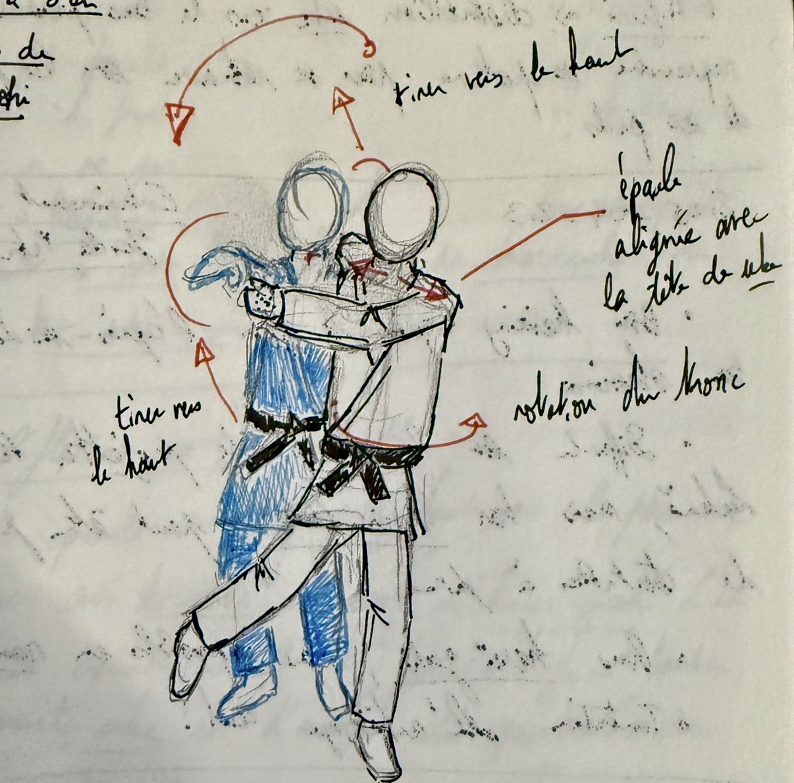

[Judo is called "the gentle way"](https://en.wikipedia.org/wiki/Judo), and it's for a reason on relying on your opponent's force to throw them (and rather not using your own strength).

This page is about _my_ gentle way, as well as, some focus on my favourite technique or at least the techniques I've focused on before and will focus on for the future. For this year (2026), my objective is to focus on ^^[ippon-seoi-nage](https://www.youtube.com/watch?v=FQnOlCxo4oI)^^.

I'll add a list of some techniques I am focusing on as well as notes about them.

!!! tip "Tokui-waza"

    [tokui-waza]("favourite techniques"), is your favourite technique, or the one you feel the most used to. It can arise through your personnal work or just naturally as your judo evolves.

## Ashi-waza

Ashi-waza or literally leg techniques are the attacks relying on foot sweep or at least your leg for the throw itself.

### Sasae-tsurikomi-ashi

A great foot technique that can be used as a setup as well as a main throw. One of the great things about sasae (and potentially hiza-guruma because they share loosely the same mechanics), is that it can double as a forward throw by continuing the rotation beyond the blocking of the foot.

This is one of the setup throws I like because you can hit it from a very wide range of grips as well as both sides.

One of the most fun approach, is to have a high grip (or to grip the seam of the gi after the collar), and to use sasae in a left motion (for me as a righty).

### ko-uchi-gari

This is probably the best cookie-cutter throw and the best for setups. This "small" inner clip of the leg of your opponent is great to get the front leg of your opponent backwards for [combinations](./combinations.md) or just as a regular throw to thrwart them.

The hikite is fundamental here in properly pulling the opponent and the tsurite will act towards the foot your are reaping.

## Koshi-waza

Koshi-waza are hip-throws, where the fulcrum is going to be your hips.

### Harai-goshi

I wanted to make it my tokui-waza, because it's a beautiful throw, unfortunately I can't use it reliably in randori, so I am leaving it as a work in progress until I find a way of making it manageable.

{width="500" }

During 2025, I have taken a lot of notes about harai-goshi, so I'll add them here.

A couple of details I have noticed to make it work

- Harai-goshi is very close in the movement to uki-goshi, in that the difference might be in the blocking with the leg
- A good advice from my friend Kuba is to align [uke]("sparring partner")'s face with your shoulder line
- The most important is to use the tsurite to really aim to lift [uke]("sparring partner") like you are taking a piece of cloth from the water
- Move all your weight on the reaping leg, a tad like a [makikomi]("technique where you fall to the ground with uke")

!!! warning "Always stick your back to uke's chest"

    If your back is not stuck to uke's chest, that is if you are broken forward and uke can lean backward, the throw will never work.

Videos for reference:

- [From Riki judo, great for details on it](https://www.youtube.com/watch?v=1qdr_NEP0wM)
- [Why your harai-goshi sucks, blind judokas](https://www.youtube.com/watch?v=4p5X9nC9a0M)
- [12 harai-goshi setups by Matt DAquino](https://www.youtube.com/watch?v=hDhLjnI1l44)

## Te-waza

Te-waza are the techniques focusing on your hand to throw the opponent. They include the leg grabs, but also many other techniques such as the seoi-nage familly of waza.

### Ippon-seoi-nage

This is the throw I will focus on my year 2026, it's not only the one that got me thrown in my December 2025 competition, but it's also a throw that I used to loathe and now I'm getting more and more to like. Let's add some notes.

- Overall, you need your hips below uke's, otherwise the throw won't work
- I think the key component for me is to look for the percussion of the hip with the legs of uke, hence the "lower than uke" posture
- Ippon-seoi-nage can work well with a lapel grip when you want to throw on the opposite side of your stance

!!! warning "Always stick your back to uke's chest"

    Just like harai-goshi, if your back is not stuck to uke's chest, that is if you are broken forward and uke can lean backward, the throw will never work.

Videos for reference:

- [Ippon-seoi-nage from Nomura Tadahiro](https://www.youtube.com/watch?v=rbAtfSqo73U)

## Important concepts

### Judo hands

{width="500" }

I believe it's important also to highlight some details on the hands, that is we call tsurite (in red in the diagram above) the hand that lifts and hikite (in green in the diagram above) the hands that pulls.
